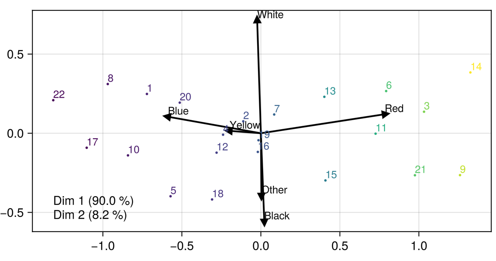

# Biplots.jl

[](https://github.com/juliohm/Biplots.jl/actions)

[Biplot](https://en.wikipedia.org/wiki/Biplot) recipes in 2D and 3D for Makie.jl.

## Installation

Get the latest stable release with Julia's package manager:

```julia
] add Biplots
```

## Usage

```julia
using Biplots
import GLMakie

# design matrix (100 obs x 5 vars)
X = rand(100, 5)

# 3D biplot with named principal axes
biplot(X, dim = 3, axeslabel = ["CO₂","O₂","N₂","S","Cu"])
```



Please check the docstring `?biplot` for available attributes.
