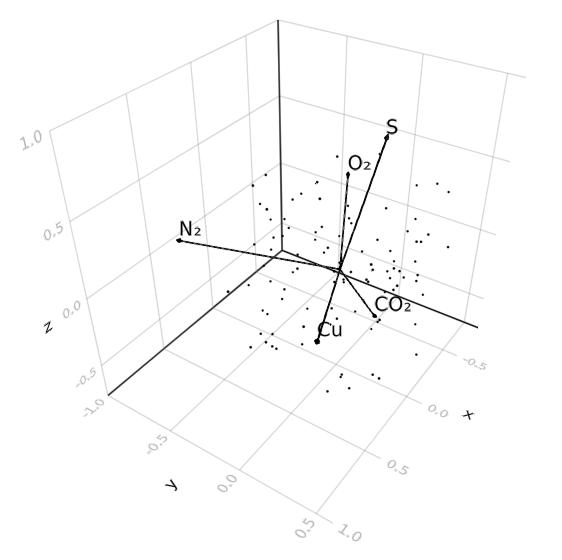

# Biplots.jl

[](https://github.com/juliohm/Biplots.jl/actions)

[Biplot](https://en.wikipedia.org/wiki/Biplot) recipes in 2D and 3D for Makie.jl.

## Installation

Get the latest stable release with Julia's package manager:

```julia
] add Biplots
```

## Usage

```julia
using Biplots
using GLMakie

# data matrix (100 obs x 5 vars)
data = rand(100, 5)
name = [:CO₂,:O₂,:N₂,:S,:Cu]

# choose any Tables.jl table
table = (; zip(name, data)...)

# 3D biplot
fig, ax = biplot(table, dim = 3)
ax.aspect = DataAspect()
```



Please check the docstring `?biplot` for available attributes.
